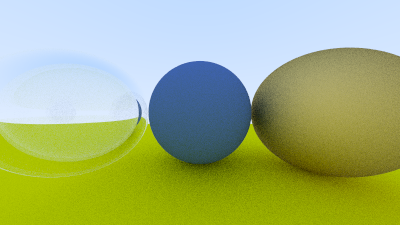
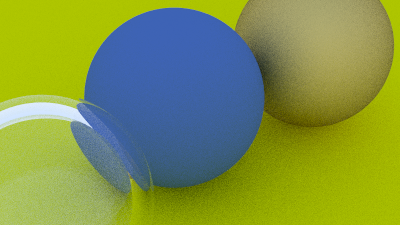

# Simple Ray Tracing

基本跟着 Ray Tracing in One Weekend 敲的，和 ShaderToy 的原理类似，主要为了加强 cpp 和对光追细节的理解。

## 细节

- hittable 抽象类可以引申出组件的想法，定义物体的某种能力（可渲染、可移动、可被hit），接口多继承，引擎中的组件系统
- 利用光线和法线的方向一致性判断交点在内部还是外部（判断内外面），翻转 normal 对齐表面方向
- spp=100 的 SSAA 确实有点慢:joy:
- 求光线的内外交点时，由于精度问题，可能在表面的外部或者内部，如果在内部光线就打不出来 (图片明显暗了一个等级，同时有黑点)，加一个偏移让`t > 0.001`
- 100spp 在这里不单单是用于 AA，因为有随机 jitter 还涉及到对漫反射光线方向的模拟，蒙特卡洛
- 单位球内的随机采样的使用蛮精彩的，可以实现 `N+R`限制 scattered direction 在法线半球内，也可以 fuzzy reflected
- 不少额外判断在精度处理和光线方向的控制上
- 俄罗斯轮盘赌用于让光线在每次反弹时以一定概率提前“死亡”，无偏估计，活下来的光线要乘上 1/p 保持期望不变
- 焦散效果，模拟非针孔的模型，在camera位置做一个抖动，模拟光圈

## 效果

     

   

